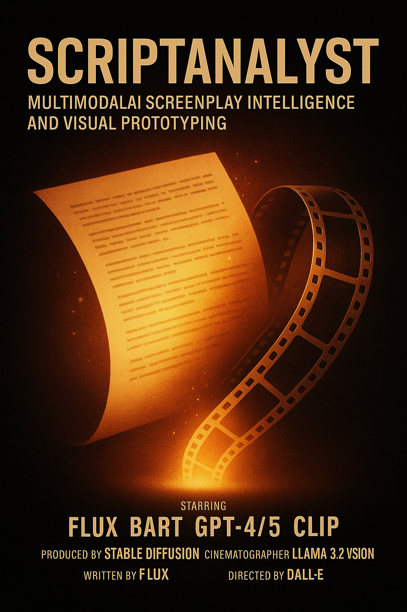

# ScriptAnalyst: MultimodalAI Screenplay Intelligence and Visual Prototyping

### From raw script to commercial potential: evaluation, summary, visual pitch assets, and market fit analysis.

#### Dr. John Hughes

> **Current Status:** Work-in-Progress (early scaffolding + experimentation)  
> Accepts scripts in PDF / Final Draft / Markdown formats



---

## Purpose

**ScriptAnalyst** is not a tool for writers. It’s built for **production companies and development executives** who need to evaluate large volumes of screenplays quickly and objectively.

The goal: **identify scripts with commercial potential** — in terms of genre fit, castability, structure, and audience appeal — and produce pitch-ready outputs like concept frames and loglines using modern NLP and multimodal generation.

The long-term goal of this project is to harness multimodal AI—text, vision, and audio models—to evaluate and amplify the commercial potential of high-ranking screenplays. By automatically generating concept art, teaser video, and narrated pitch assets from the script, ScriptAnalyst moves beyond evaluation into the realm of AI-assisted content visualization. It turns raw scripts into studio-ready pitch packages that support production teams in assessing marketability and creative fit.

---

## Features Overview (Planned)

- **Screenplay Evaluation**
  - Predict script quality based on structure, themes, tone, and trained embeddings
  - Generate loglines and synopses
  - Identify key beats, characters, and pacing patterns
- **Market Analysis**
  - Match scripts to comparable films and audience demographics
  - Suggest potential lead actors via trait-to-filmography matching
- **Pitch-Ready Visuals**
  - Generate concept frames and poster-style visuals from key scenes
  - Generate teaser scenes with video and audio
  - Output pitch-pack starter assets automatically

---

## Quickstart

```bash
# Clone the repo
git clone https://github.com/yourusername/scriptanalyst.git
cd scriptanalyst

# Set up environment
conda env create -f environment.yml
conda activate scriptanalyst

# Launch Jupyter for exploration
jupyter lab

# Requires Python 3.10+. Scripts assume Linux/macOS or WSL. GPU support optional but recommended for image generation.
```

---


## Current Experiments

Early-stage development includes basic **statistical analysis of script structure**, including length, character balance, and pacing:

[01_ingest_and_parse.ipynb](notebooks/01_ingest_and_parse.ipynb)

---

## Phased Roadmap

### **Phase 1** – Core Evaluator
- Script summary, beat extraction, genre/tone classification
- Demographic alignment and lead actor suggestions
- Visuals: key scene concept art + pitch poster (via diffusion model)

### **Phase 2** – Deeper Embedding-Based Analysis
- Sentiment curves, readability signals
- Style matching via sentence/scene embeddings
- Identify high-potential themes and genre signatures

### **Phase 3** – Automated Pitch Pack
- Logline, elevator pitch, character breakdowns
- Poster + 3–5 key scenes as visuals
- Auto-animatic teaser with audio (Storyboard-to-Video)

---

## Tech Stack (Exploratory, Modular)

This tech stack spans several AI subdomains. Not all tools will be used — the design is modular, iterative, and multimodal.

### Core Analysis
| Feature | Description | Tech Stack |
|--------|-------------|------------|
| Script Quality Estimator | Predicts potential success based on labeled training data (box office, critic scores, Black List scores) | Fine-tuned GPT-2, BERT/DistilBERT, Scikit-learn baseline |
| Summarization / Logline Generator | Extracts concise synopses and one-line hooks | T5, BART, GPT-4/5, LLaMA 3.2 |
| Scene & Beat Breakdown | Structural segmentation and pacing analysis | Custom NLP pipeline |

### Market Matching
| Feature | Description | Tech Stack |
|--------|-------------|------------|
| Demographic Prediction | Estimates likely viewer age, gender, genre interest | LLaMA 3, GPT-4o, heuristics |
| Comparable Films | Embedding-based similarity search across known titles | Sentence Transformers + FAISS or CLIP |
| Actor Matching | Suggests leads based on role traits + actor embeddings | IMDb + vector DB (Pinecone, Qdrant) |

### Visual Generation
| Feature | Description | Tech Stack |
|--------|-------------|------------|
| Concept Frames / Posters | Generate visual assets from script segments | Stable Diffusion, DALL·E 3, FLUX, AnimateDiff |

### Future Enhancements
| Feature | Description | Tech Stack |
|--------|-------------|------------|
| Thematic Marketability Detection | Embedding models highlight recurring themes with commercial promise | Sentence Transformers, CLIP |
| Auto-Teaser Generation | Text-to-video pipeline for short animated scene previews | Gen-2, Sora, Kling, Luma, Whisper, AnimateDiff |

---

## Project Structure
```
multimodalai-scriptscope/
├─ notebooks/
│  ├─ 01_ingest_and_parse.ipynb
│  ├─ 02_analysis_pipeline.ipynb
│  └─ 03_concept_frames.ipynb
├─ src/
│  ├─ ingest/     # PDF/Fountain/FDX parsing
│  ├─ nlp/        # segmentation, entities, beats
│  └─ visuals/    # diffusion pipeline & prompts
├─ assets/
│  └─ ScriptAnalyst.png
├─ environment.yml
├─ LICENSE
└─ README.md
```

---

## Legal/Usage Note

Only analyze scripts you own or are licensed to process. All visual assets are concept-only, not production-ready.

---

## License

MIT

---

## Topics

`screenplay-analysis` · `nlp` · `diffusion` · `market-fit` · `casting-intelligence` · `vision-llm` · `multimodalai`
